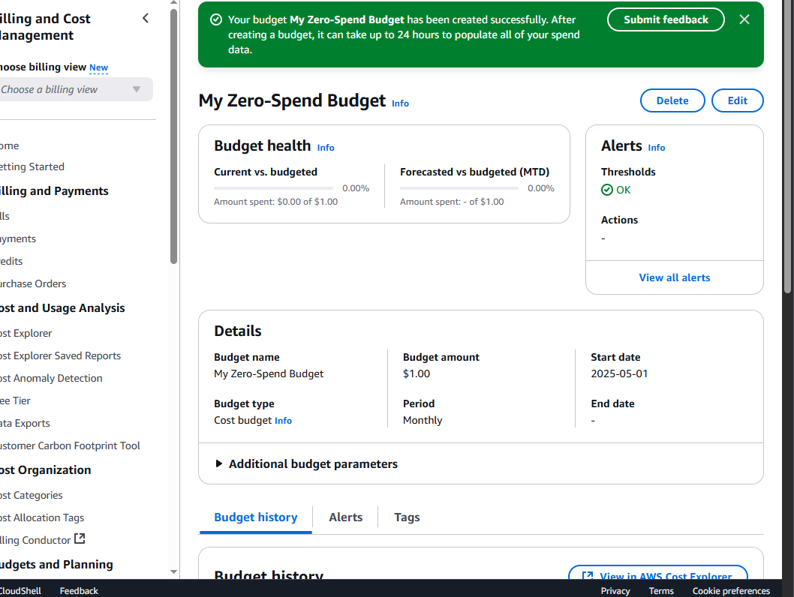

# aws-setup

1. I created the account
2. I created a budget
3. I added a IAM user
4. Added permissions 
5. signed out of root and back in under IAM user

I do enjoy the fact that there is so much data indexed (128 TiB)into one location with built in security features including a virtual private cloud. You can also pause access to your work until you need it and its fully encrypted.